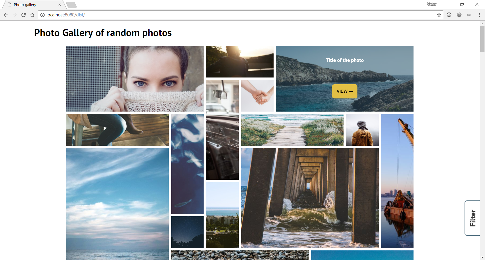
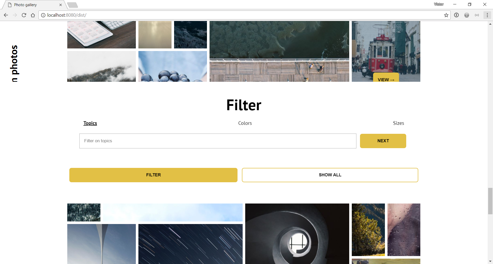

# Photo Gallery of random images

For this assignment I made an photo gallery with photos from [Picsum](https://picsum.photos). It uses around three principles of design of [Joshua Porter](http://bokardo.com/principles-of-user-interface-design/).


> Try the
> [**prototype**](https://velomovies.github.io/web-design/opdracht2/dist/).

## Background

This app shows an big photo archive. You can search trough all the photos. Next to that I faked a little filter option.

 Its layout is done with `grid`. I used an `eventListener` on scroll. The first time you come it shows the filter.
```javascript
element.addEventListener('scroll', function () {
  // ... your code
})
```
When the filter works it would show you the right photos. 

When you haven't filtered yet the user sees the weird grid layout. When the user specified some things it shows a clean grid. 
Thats done with css where I made sure all elements had the same `span`.

## Principles
The principles I used where:

06. **One primary action per screen**

There is always one primary thing you can do in each state. 
  - Show photos at the home screen
  - Filter the photos
  - Close the photo when opened

11. **Strong visual hierarchies work best**

A hierarchy is one of the most important things in design. In every design you have to check this.

14. **Progressive disclosure**

The app uses a little `progressive disclosure`. In the filter you can choose different filter types. You can see the filters as next step but it is not already on one page.

15. **A crucial moment: the zero state**

The app uses a `zero state`. If the user sees the page for the first time it will show the user the filter options when scrolled far down. 


## Features


> A filter option

- Always showing the title
- Make the photo bigger
- Filter 
- Animations (fade-in/slide-in)

## To Do

- A working filter function. 
- Showing what filters are used

## License

GPL-3.0 © Victor Zumpolle