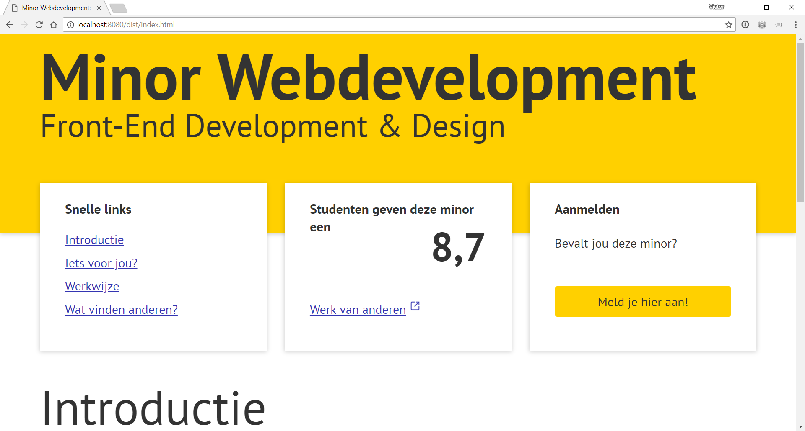
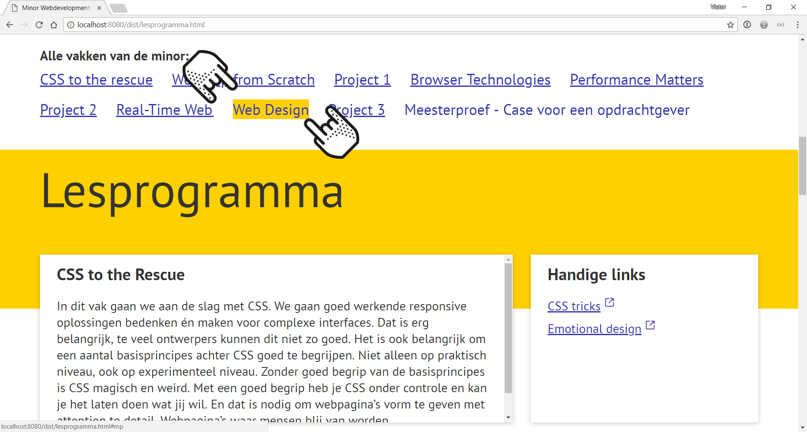
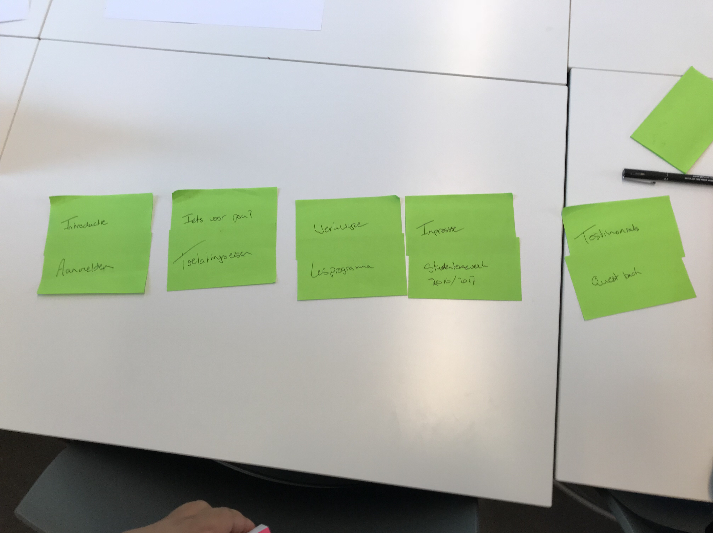
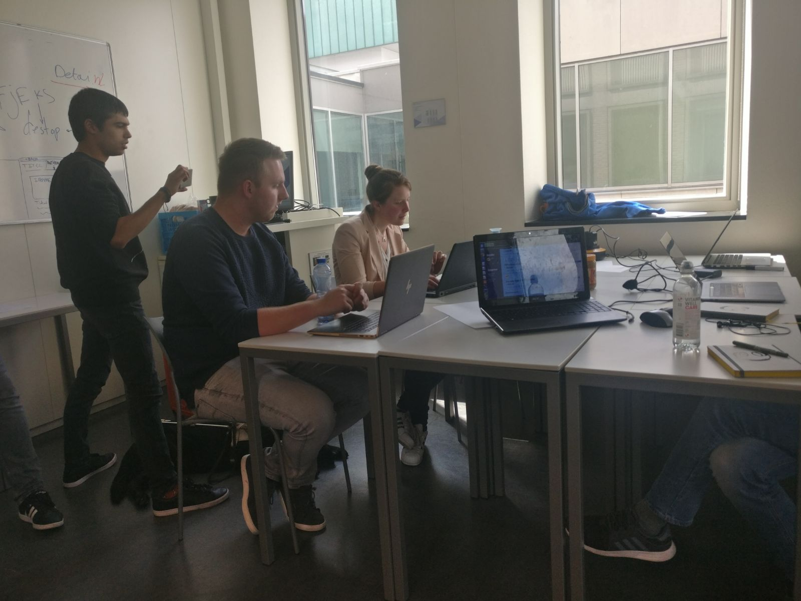

# CMD Webdev website

For this assignment I made an redisign of the cmd website from [CMD-minor](https://cmda.github.io/minor-everything-web/). Using two different people as persons who use my website.


> Try the
> [**prototype**](https://velomovies.github.io/web-design/opdracht2/dist/).


# Table of contents
- [CMD Webdev website](#cmd-webdev-website)
  * [Background](#background)
  * [Features](#features)
  * [Principles](#principles)
  * [Content](#content)
  * [My people](#my-people)
  * [Tests](#tests)
  * [To Do](#to-do)
  * [License](#license)

## Background

This is a website for the minor webdevelopment. I did a redesign for this website. On the website you can find information of how to enter the minor, what courses are given and read what others tought and made. 

It is a website totally optimalized for blind people. Next to that I made the website accesible for screenreaders. Next to that I made it responsive fun to use for people using a keyboard. 

I made a `before` and `after` on the focus state. It is a very obvious focus and fun to look at. 

```SCSS
&:before, &:after {
    content: '';
    position: absolute;
    background: url(../images/cmd_icon_hand.png);
    background-size: contain;
    width: 5em;
    height: 5em;
    z-index: 3;
  }
  &:before {
    top: -4em;
    left: -4em;
    transform: rotate(135deg);
    animation: breathingBefore 3s ease-out infinite normal;
  }
  &:after {
    right: -4em;
    transform: rotate(-45deg);
    animation: breathingAfter 3s ease-out infinite normal;
  }
}
```

## Features


> Preview

I implemented a few features. The feature that works for screenreader is the way the links are read. I made a custom aria text so I could change what is said about the links. When it is a link to an external website it says that.
```HTML
  <a class="extern" href="Link" aria-label="link externe website naar werk van anderen" target="_blank">Link naar externe bron</a>
```

The website is also mobile accesible. It is responsive and that makes it easier to read for all the persons I made the website for. I made three major breakpoints. 
```SCSS 
$small-screen: 40em; 
$screen: 50em; 
$big-screen: 70em;
```

I made a way to read about the courses so you can do some study at home. Every course has it own links to cool articles or projects. 

## Principles
The principles I used where:

01. **Clarity is job #1**

By making the page big and clean it is easy to know where you are and what you want to do. It is made up spacious so tha way it is not to difficult where to find anything

09. **Appearance follows behavior**

By making links for instance the way everybody knows links it is immidiatly clear that you can click and see information about that link.

10. **Consistency matters**

Every link and every heading and space is the same on the whole website.

11. **Strong visual hierarchies work best**

I tried to get a really strong hierarchy that enables people to see what is important. Making things really big to a little smaller it gets a great hierarchy.

## Content

Content on whole site

**One page on new website**

- Introductie
  - tekst
- Aanmelden
  - tekst

**One page on new website**

- Iets voor jou
  - tekst
- Toelatingseisen
  - tekst

**One page on new website**

- Werkwijze
  - tekst
- Lesprogramma
  - lijst (10 items) / tekst

**One link on new website**

- Studentenwerk
  - Link (naar github)
- ~~Impressie foto's~~

**One page on new website**

- Testimonials
  - tekst
- Questback
  -lijst (19 items) / tekst


> Cardsorting the website on the basis of the content

## My people

**Larissa**

Larissa is a blind person. She can see only the difference between dark and light. She is an olympic cyclist and tests websites for accesibility. Larissa wants to see all information on a website, but most of the times the websites are not made for that She works with a screenreader and all input is done by keyboard.

**Student**

The second person I made the website for is a student. The student is from another study and doesn't know what the minor is about. Also he doesn't know where the study is about. All the descriptions of the courses are vague to him. He wants to know how you can learn more about that certain course.

## Tests

The scenario where I tested on:
As student you are looking for a minor. You want to know where this minor is about. Which courses are given and how to enroll for this minor.


> Doing the test with Larissa

Larissa could easily get where the website was about. The screenreader reads the 
```HTML 
<title></title>
```
This way you can manipulate what is said about the page she is on.

There where a few minor problems she ran into. What stand out to her is that the main content had an heading 4. This is actually to far in the `DOM`. I have to make `h2` to make it easier to find her way.


> Doing the test with Larissa

Because of the headings she was a bit lost and in confusion of where to be. When Larissa is making a website herself she is always in dubio where to put different headings. In her head it is logic, but for someone else it isn't. That is the same problem I ran into. In the end she finally found it and she could read about all the courses

After the test I made some minor adjustments. Removing the `role="menu"` should make the menu behave different. She ran in to the problem that the menu items weren't read propperly on her computer in chrome.

It was a little difficult to simulate the problems, because the screenreader Larissa is not the same as the one on my computer. I couldn't test real scenarios.

When Larissa knows where to be, she can be even faster than people that can see there screen or use there mouse. It is always a predictions for her where she can find things. If she needs contact information, she is going to guess it is in a list and search all lists on the website. 

## To Do

* Making sure all test results are implemented in the website.
  * Working menu for screenreaders
  * Higher hiarchy headings for important content
  * Focus on the page on keyboard input

## License

GPL-3.0 © Victor Zumpolle