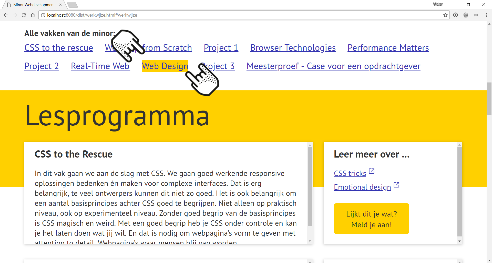

# CMD Webdev website

For this assignment I made an redisign of the cmd website from [CMD-minor](https://cmda.github.io/minor-everything-web/). Using two people as persons who use my website.

> Try the
> [**prototype**](https://velomovies.github.io/web-design/opdracht2/dist/).

## Background

This app is about...

## My people

**Larissa**

**Student**
The second person I made the website for is a student. The student is from another 

## Features

> Preview

- things

## Tests

The scenario where I tested on:
As student you are looking for a minor. You want to know where this minor is about. Which courses are given and how to enroll for this minor.

## To Do

- things

## License

GPL-3.0 © Victor Zumpolle